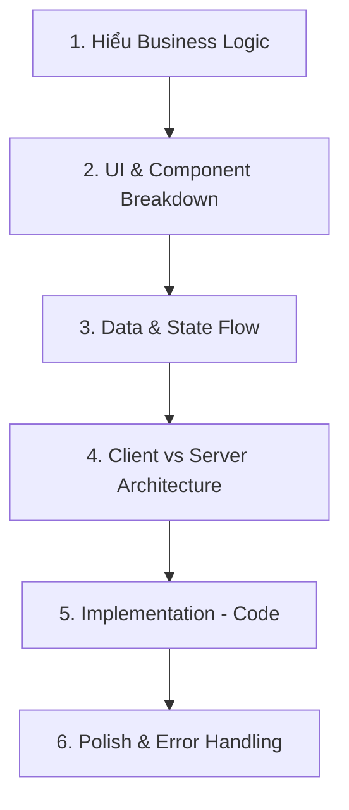

# Sổ tay Phát triển Tính năng (Feature Development Handbook)
**ReactJS & Next.js (App Router) cho Backend Developer**

Chào mừng bạn đến với Frontend! Là một Backend Developer, bạn đã có sẵn tư duy logic, cấu trúc dữ liệu và kiến trúc hệ thống rất tốt. Khó khăn lớn nhất khi chuyển sang React/Next.js thường không nằm ở code, mà là ở **tư duy hướng Component**, **quản lý State** và **vòng đời render**.

Tài liệu này được thiết kế để "map" (ánh xạ) tư duy Backend (MVC, Layered Architecture) sang tư duy Frontend hiện đại (Feature-based, Component-driven).

---

## 1. Mindset khi phát triển một feature (Tư duy luồng)

Đừng vội mở file và gõ code UI! Một Senior Frontend sẽ đi qua 5 bước sau:



* **1. Hiểu Business Logic:** Tính năng này giải quyết vấn đề gì? (VD: User dán hợp âm gốc -> Chọn tone -> Ra hợp âm mới).
* **2. UI & Component Breakdown:** Giao diện này chia thành các khối độc lập nào?
* **3. Data & State Flow (Tương đương Entity/DTO):** Dữ liệu chảy từ đâu đến đâu? Cần lưu trữ state ở component nào? Có chia sẻ state toàn cục (Zustand/Redux) không?
* **4. Client vs Server (Đặc thù Next.js):**
    * Phần nào cần SEO, lấy dữ liệu nhanh từ DB? -> **Server Component** (Tương đương Controller/Service gọi DB trực tiếp).
    * Phần nào có event `onClick`, `onChange`, `useState`? -> **Client Component**.
* **5. Implementation:** Bắt tay vào viết code (Type -> Mock Data -> Hook -> UI -> API).
* **6. Polish:** Xử lý Loading, Error, Edge cases.

**Tại sao phải theo luồng này?** Vì nếu code UI ngay, bạn sẽ nhồi tất cả Logic, State, và UI vào một file `page.tsx` khổng lồ (Giống như viết tất cả logic DB vào Controller thay vì Service).

---

## 2. Quy trình phân tích yêu cầu (Use Case: Community / Thư viện cảm âm)

Khi nhận một tính năng lớn như **Community** (nơi user chia sẻ bản cảm âm), hãy đặt các câu hỏi để "vét cạn" use-case:

**A. Render Strategy (Chiến lược Render)**
- **Mục tiêu:** Trang này có cần SEO không? Có cần load ngay lập tức không?
- **Quyết định:** Danh sách bài hát public CẦN SEO -> Dùng **Server Component** để fetch data ban đầu.

**B. State & URL (Quản lý trạng thái)**
- **Câu hỏi:** Phân trang, Tìm kiếm, Lọc theo Tone lưu ở đâu?
- **Quyết định:** Lưu vào **URL Search Params** (`?page=1&tone=C&search=em+gai+mua`).
- **Lý do:** Để user copy link gửi cho bạn bè vẫn giữ nguyên trạng thái filter (Rất quan trọng trong Frontend). Không dùng `useState` cho những thứ cần share link.

**C. Trạng thái UI (UI States)**
Một tính năng fetch data luôn có 4 trạng thái:
- **Loading:** Hiển thị Skeleton hay Spinner?
- **Empty:** Nếu không có bài hát nào, UI hiển thị gì (Illustration + Nút "Tạo bài mới")?
- **Error:** Nếu API tèo, hiển thị lỗi gì? Nút "Thử lại"?
- **Success:** Render danh sách bài hát.

**D. Trải nghiệm người dùng (UX - Optimistic Update)**
- Khi user bấm "Thích" (Like) bài hát, có đợi API trả về thành công mới đổi màu nút Like không?
- **Senior:** Đổi màu nút Like NGAY LẬP TỨC (Optimistic Update). Nếu API lỗi thì roll back lại.

---

## 3. Quy trình thiết kế UI & Component Breakdown (Use Case: Converter)

**Nguyên tắc SRP (Single Responsibility Principle) trong UI:** Một component chỉ làm MỘT việc.

Ví dụ giao diện **Converter 2 ô text** (Trái: Hợp âm gốc, Phải: Kết quả):

```text
[Page] (Quản lý layout tổng)
 ├── [ConverterHeader] (Tiêu đề, hướng dẫn)
 ├── [ToneSelector] (Dropdown chọn tone - Chỉ quan tâm việc chọn Tone)
 └── [EditorWorkspace] (Quản lý state 2 ô text)
      ├── [SourceEditor] (Ô nhập liệu, bắt sự kiện onChange)
      └── [ResultViewer] (Ô hiển thị, syntax highlight hợp âm)
```

**Cách chia:**
- `Page`: Server Component, bọc layout.
- `ToneSelector`: Client Component, nhận props `currentTone`, `onToneChange`. Không chứa data bài hát.
- `EditorWorkspace`: Client Component (chứa `useState` cho văn bản đầu vào). Nó truyền text cho `SourceEditor` và truyền text sau khi dịch cho `ResultViewer`.

**Lỗi hay gặp:** Để cái hàm tính toán dịch tone (Tone Shift Logic) trực tiếp trong `ResultViewer`.
**Senior xử lý:** Tách logic dịch tone ra một file `utils/toneShift.ts` (giống helper/service của Backend). Component chỉ có nhiệm vụ GỌI hàm và RENDER.

---

## 4. Quy trình thiết kế Folder (Feature-based Architecture)

Không vứt mọi thứ vào `src/components`. Trong dự án lớn, hãy gom nhóm theo **Tính năng (Feature)** (tương đương với các Domain/Module trong DDD của Backend).

```text
src/
 ├── app/                    # Next.js App Router (Chỉ chứa page.tsx, layout.tsx để route)
 │    ├── (auth)/login/page.tsx
 │    └── converter/page.tsx 
 │
 ├── components/             # UI Components dùng chung (Core/Shared)
 │    ├── ui/                # shadcn/ui components (Button, Input, Modal)
 │    └── layout/            # Header, Footer, Sidebar
 │
 ├── features/               # Lõi của ứng dụng: Chia theo Domain
 │    ├── converter/
 │    │    ├── components/   # Chỉ các component của converter (ToneSelector, Editor)
 │    │    ├── hooks/        # custom hooks (useToneShift.ts)
 │    │    ├── services/     # Gọi API (converter.api.ts)
 │    │    ├── utils/        # Logic thuật toán (transposeNote.ts)
 │    │    └── types/        # TypeScript interfaces
 │    │
 │    └── community/         # Domain cộng đồng
 │         ├── components/
 │         ├── hooks/
 │         └── ...
 │
 └── lib/                    # Cấu hình thư viện (axios.ts, utils.ts cho tailwind)
```

**Tại sao?** Khi bạn cần sửa tính năng Converter, bạn chỉ mở thư mục `features/converter`. Mọi thứ (UI, Logic, API) nằm gọn ở đó, không sợ sửa nhầm ảnh hưởng tính năng khác.

---

## 5. Định lượng: Khi nào nên tách file / tách code?

**"Rule of thumb" (Nguyên tắc kinh nghiệm):**

1. **Độ dài Component:** Nếu một file vượt quá **200 - 250 dòng**, đã đến lúc tách.
2. **Khi nào dùng Custom Hook (`useToneShift`)?**
   - Khi component có quá nhiều `useState`, `useEffect` (dài hơn 30 dòng logic).
   - Tư duy: Tách phần "Bếp" (Custom Hook) ra khỏi "Phòng ăn" (Component render UI). Component chỉ cần gọi `const { text, shiftUp, shiftDown } = useToneShift()`.
3. **Khi nào cho vào `utils`?**
   - Các hàm tính toán thuần túy (Pure Functions), không phụ thuộc vào React state hay hooks.
   - Ví dụ: `parseChords(text)`, `calculateDistance(noteA, noteB)`.
   - Lợi ích: Dễ dàng viết Unit Test (giống hệt test Utils trong Java).
4. **Khi nào tách UI component?**
   - Khi một đoạn UI (VD: `Card` bài hát) bị lặp lại 2 lần trở lên.
   - Khi một đoạn UI quá phức tạp, làm rối file chính (VD: Một cái Modal chứa form dài).

---

## 6. Luồng thực thi tạo feature mới (Step-by-step)

Mô phỏng suy nghĩ làm tính năng **"Lưu bài hát vào Thư viện"**:

1. **Định nghĩa Type (Tương đương DTO/Entity):**
   * "Đầu tiên tôi sẽ tạo `type Song = { id: string, title: string, content: string, originalTone: string }` để có autocomplete và bắt lỗi chặt chẽ."
2. **Làm Mock Data & Dựng UI tĩnh (Dummy UI):**
   * "Tôi chưa gọi API vội. Tôi tạo `const MOCK_SONGS = [...]` để truyền vào UI. Dựng giao diện danh sách, nút bấm cho đẹp và đúng layout đã."
3. **Xử lý State & Tương tác (Custom Hook):**
   * "UI đã đẹp. Giờ tôi viết `useSaveSong()`. Trong này có `isSaving`, `error`. Viết các hàm giả lập delay 1s để xem UI Loading hoạt động chưa."
4. **Ghép API & Call Network:**
   * "Thay đoạn mock logic bằng hàm gọi API thực tế (axios hoặc fetch). Kết nối vào Backend Spring Boot."
5. **Xử lý luồng Error & Edge cases:**
   * "Test thử tắt mạng -> Xem UI có báo lỗi không. Báo lỗi bằng Toast notification."

---

## 7. Kiến trúc Clean Code trong React + NextJS

Hãy hình dung nó giống như mô hình 3 lớp (3-Tier) trong Spring Boot:

| Lớp (Layer) | Trong Backend (Spring) | Trong React/Next.js | Nhiệm vụ |
| :--- | :--- | :--- | :--- |
| **Presentation** | Controller / View | UI Components (`.tsx`) | Chỉ lo hiển thị HTML/CSS. Nhận dữ liệu và render. |
| **Business/State** | Service Layer | Custom Hooks (`use...`) / Zustand | Xử lý logic nghiệp vụ, quản lý trạng thái (`loading`, `data`). |
| **Data/Network** | Repository / DAO | API Services (`fetch`, `axios`) / Server Actions | Giao tiếp với API bên ngoài, Database. |
| **Utility** | Utils / Helpers | `utils/`, `helpers/` (`.ts`) | Các hàm support độc lập (Regex, Date format). |

---

## 8. Quy tắc đặt tên (Naming Conventions)

Sự nhất quán là chìa khóa của Senior:

* **Component:** `PascalCase`. VD: `SongCard.tsx`, `ToneSelector.tsx`.
* **Hooks:** `camelCase`, bắt đầu bằng `use`. VD: `useSongLibrary.ts`, `useAuth.ts`.
* **Event Handlers:**
    * **Prop truyền vào:** Bắt đầu bằng `on`. VD: `interface Props { onSave: () => void, onToneChange: (tone: string) => void }`
    * **Hàm thực thi bên trong:** Bắt đầu bằng `handle`. VD: `const handleSave = () => { ... }`. Gọi: `<Button onClick={handleSave} />`.
* **Types/Interfaces:** `PascalCase`. (Có thể thêm tiền tố `I` hoặc không, nhưng xu hướng hiện nay là KHÔNG thêm). VD: `type User = {}`, `interface SongPayload {}`.
* **File logic/utils:** `camelCase` hoặc `kebab-case`. VD: `stringUtils.ts`, `api-client.ts`.

---

## 9. Checklist "Done" trước khi commit (Đặc thù Next.js)

Là Senior, không chỉ "chạy được là xong". Hãy check:

- [ ] **Chỉ định Client/Server Component:** Đã để `'use client'` ĐÚNG CHỖ chưa? (Chỉ ở những component thật sự cần state/event, đẩy `'use client'` xuống sâu nhất có thể).
- [ ] **Loading State:** Đã có Skeleton hoặc Spinner cho các thao tác đợi API chưa?
- [ ] **Error Handling:** Try/catch gọi API đã đầy đủ chưa? Đã có Toast báo lỗi cho user chưa? (VD: "Lưu thất bại, vui lòng thử lại").
- [ ] **Empty State:** Danh sách rỗng đã có UI báo hiệu chưa?
- [ ] **Re-render Optimization:** Component có bị re-render vô tội vạ không? (Cài React Developer Tools extension để soi).
- [ ] **Responsive:** Đã test UI trên màn hình Mobile và Tablet chưa? (Tailwind: `md:`, `lg:`).
- [ ] **Cleanup:** Các `useEffect` (nếu có dùng setInterval, event listener) đã có hàm `return () => cleanup()` chưa?

---

## 10. Những lỗi (Anti-patterns) Junior thường gặp & Cách Senior khắc phục

### ❌ Anti-pattern 1: Lạm dụng `'use client'` ở Root Layout hoặc Page ngoài cùng.
* **Hậu quả:** Giết chết toàn bộ lợi ích SEO và tốc độ tải trang (Server-Side Rendering) của Next.js.
* **Senior làm:** Tách riêng cái nút cần tương tác ra thành 1 component nhỏ (VD: `<ThemeToggleButton />`), đặt `'use client'` ở file đó, rồi import vào Server Component.

### ❌ Anti-pattern 2: Gọi API bằng `useEffect` (Bệnh từ React cũ).
```tsx
// ❌ ĐỪNG LÀM THẾ NÀY trong Next.js App Router
useEffect(() => {
  fetch('/api/songs').then(...)
}, [])
```
* **Senior làm:** 
    * Nếu cần SEO/Render ngay: Fetch trực tiếp trong Server Component (`const data = await getSongs()`).
    * Nếu gọi ở Client: Dùng thư viện như **SWR** hoặc **TanStack React Query** để nó tự lo cache, loading, error, retry.

### ❌ Anti-pattern 3: Prop Drilling quá sâu.
* **Hậu quả:** Truyền `data` và `setTheme` qua 5 lớp Component con.
* **Senior làm:** Dùng **Zustand** (Global state) để quản lý state toàn cục, hoặc **React Context** (nếu scope nhỏ), hoặc truyền Node (Children/Slots).

### ❌ Anti-pattern 4: Viết mọi logic UI và API vào một hàm `handleSubmit`.
* **Senior làm:** Tách hàm gọi API sang folder `services/`. Hàm `handleSubmit` chỉ gọi service, đổi state `isSubmitting`, và hiển thị Toast thành công/lỗi.

### ❌ Anti-pattern 5: Quên "Dependencies" trong `useEffect`, `useCallback`.
* **Hậu quả:** Lỗi logic khó hiểu hoặc vòng lặp vô tận (Infinite loop).
* **Senior làm:** LUÔN bật linter (`eslint-plugin-react-hooks`) và tuân thủ cảnh báo dependency array. 

---
*Hy vọng tài liệu này sẽ giúp bạn dễ dàng chuyển đổi tư duy từ một Backend Developer sắc bén sang một Frontend Developer tinh tế. Hãy code với sự hệ thống!*
