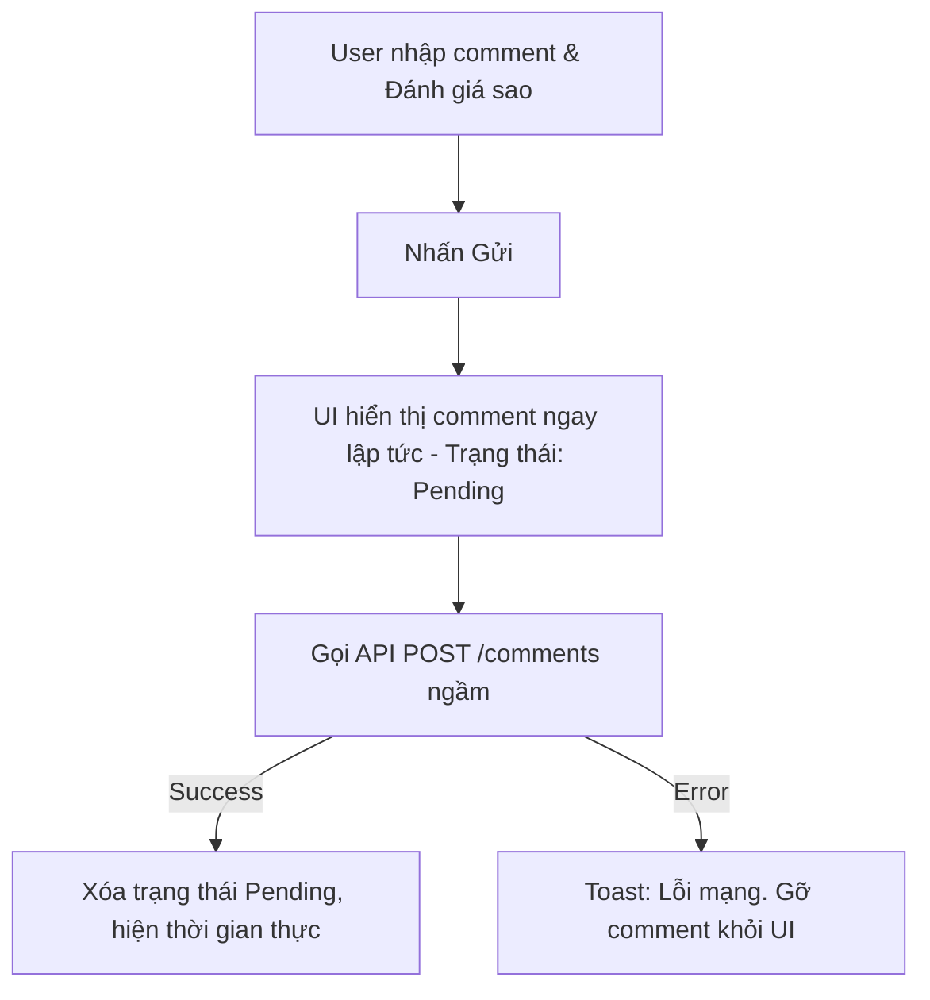

# Thiết kế tính năng: Community Rating & Comments

## 1. Feature Design (Business Requirements)

### 1.1. Yêu cầu nghiệp vụ
Hệ thống cho phép cộng đồng tương tác trên một bài hát public thông qua việc Đánh giá (Star Rating) và Bình luận (Comment). Hỗ trợ các tương tác sâu như Reply, Like, Report, Sắp xếp, Lọc, và Pagination (Lazy Load / Infinite Scroll).

### 1.2. Phân tích Kỹ thuật (Technical Analysis)
Tính năng này thiên về **Data-heavy & Interaction-heavy** ở phía Client.
- Cần **Optimistic Update**: Khi user bấm Like hoặc Gửi Comment, UI phải phản hồi ngay lập tức, ngầm gọi API sau (để tránh cảm giác lag).
- Cần **Infinite Scroll**: Tránh load 1000 comments cùng lúc.
- **Derived State**: Điểm trung bình (Average Rating) cần được tính toán ở Backend, Client chỉ hiển thị.

---

## 2. UI Flow (Luồng tương tác)

### 2.1. Luồng Gửi Bình luận (Optimistic)


### 2.2. Luồng Cuộn trang (Infinite Scroll)
User cuộn xuống cuối màn hình -> Intersection Observer trigger -> Fetch API Page N+1 -> Append vào danh sách hiện tại.

---

## 3. Database Design

Cần thiết kế 3 bảng chính (Relational Database):

1. **`ratings`** (1 user - 1 bài hát chỉ có 1 rating):
   - `id`, `user_id`, `song_id`, `score` (1-5), `created_at`, `updated_at`.
2. **`comments`** (Tree structure cho reply):
   - `id`, `user_id`, `song_id`, `parent_id` (Nullable - Cho reply), `content`, `created_at`, `updated_at`, `deleted_at` (Soft delete).
3. **`comment_likes`**:
   - `user_id`, `comment_id`, `created_at`.
4. **`reports`**:
   - `id`, `reporter_id`, `comment_id`, `reason`, `status`.

---

## 4. API Design

> **Cập nhật (Backend Java):** contract chính thức nằm ở [`../backend/01-API-Contract.md`](../backend/01-API-Contract.md) mục 5. Thay đổi so với bản nháp cũ: cursor thật (chuỗi opaque), like/unlike tách `POST`/`DELETE`.

### 4.1. Lấy danh sách Comments (Cursor Pagination)
- **GET** `/api/songs/:id/comments?cursor=&limit=20&sortBy=newest|top`
- **Response:**
  ```json
  {
    "data": [
      { "id": "c1", "content": "Hay quá", "deleted": false, "user": {...}, "likes": 5, "isLiked": false, "repliesCount": 2 }
    ],
    "nextCursor": "eyJ0IjoiMjAyNi0wNS0zMFQxMDoxNTozMFoiLCJpIjoiYzEifQ", // opaque, null khi hết. Phục vụ Infinite Scroll
    "hasNext": true,
    "total": 150
  }
  ```

### 4.2. Các Action API
- **POST** `/api/comments` (Body: `songId`, `content`, `parentId`) → 201
- **PUT** `/api/comments/:id` (Body: `content`)
- **DELETE** `/api/comments/:id` → 204
- **POST** `/api/comments/:id/like` → `{ likes, isLiked: true }` (idempotent)
- **DELETE** `/api/comments/:id/like` → `{ likes, isLiked: false }` (idempotent)
- **POST** `/api/comments/:id/report` → 201
- **GET** `/api/comments/:id/replies?cursor=&limit=20`
- **PUT** `/api/songs/:id/rating` (Body: `{ score }`), **GET** `/api/songs/:id/rating-summary`

---

## 5. Folder Structure & Component Design

**Thư mục:** `src/features/community-rating/`

**Component Tree:**
```text
CommunitySection
 ├── RatingSummary (Hiển thị 4.5 ⭐️ và Thanh progress bar cho từng sao)
 ├── CommentForm (Ô nhập liệu, Avatar)
 ├── CommentFilter (Sort by Mới nhất, Phổ biến)
 └── CommentList (Chứa Infinite Scroll Wrapper)
      └── CommentItem (Hiển thị 1 comment)
           ├── CommentHeader (User, Time)
           ├── CommentBody (Nội dung)
           └── CommentActions (Like, Reply, Report)
                └── ReplyList (Đệ quy / Render nested)
```

---

## 6. State Management

Vì tương tác rất phức tạp, ta sẽ dùng **TanStack React Query** (Tiêu chuẩn vàng cho Data Fetching + Caching hiện nay):

- **Fetching**: Dùng `useInfiniteQuery` để gọi API phân trang. Nó tự lo việc ghép mảng data khi cuộn trang.
- **Optimistic Updates**: Khi Like bình luận, gọi `queryClient.setQueryData` để sửa số like +1 trên bộ nhớ đệm (cache) ngay lập tức.
- **Local State**: `useState` cho Form input (`content`), trạng thái mở Reply Box.
- **Global/URL State**: Sort, Filter (vd: `?sort=top`) đưa lên URL Search Params để dễ share.

---

## 7. Refactoring & Technical Debt
- **Vấn đề N+1 Query ở Backend:** Khi query comments, nếu không dùng `JOIN` hoặc `DataLoader` để lấy thông tin User, Backend sẽ bị chậm.
- **Độ sâu của Reply:** Chỉ nên cho phép Reply 1 cấp (như YouTube) hoặc 2 cấp. Không nên cho đệ quy vô hạn vì sẽ vỡ layout Mobile.
- **Debounce:** Khi user click Like liên tục, cần dùng kỹ thuật Throttle/Debounce ở client để tránh spam API.

---

## 8. Development & Testing Checklist
- [ ] Xây dựng bộ UI Component tĩnh (Storybook).
- [ ] Tích hợp `IntersectionObserver` hoặc dùng thư viện (như `react-intersection-observer`) cho Infinite Scroll.
- [ ] Code logic Optimistic Update cho chức năng Like.
- [ ] **Edge Case:** Xử lý hiển thị "Comment đã bị xóa" nếu nó có chứa Replies con (Giữ lại node cha, hiển thị text "Deleted").
