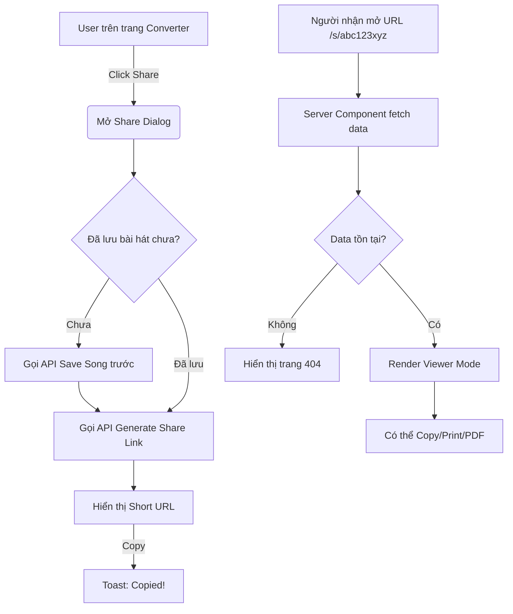

# Thiết kế tính năng: Shareable Link

## 1. Feature Design (Business & Requirements)

### 1.1. Yêu cầu nghiệp vụ (Business Requirement)
Cho phép người dùng chia sẻ bản cảm âm sau khi chuyển tone thành công dưới dạng một URL duy nhất (`toneshift.vn/s/abc123xyz`). Người nhận link có thể xem, copy, in, tải PDF nhưng không được chỉnh sửa (trừ người tạo).

### 1.2. Yêu cầu chức năng (Functional Requirement)
- Nút **Share** trên giao diện sau khi chuyển tone.
- Sinh ra short URL ngẫu nhiên, định dạng `/s/[unique-code]`.
- Giao diện **Viewer Mode** cho khách truy cập:
  - Chỉ xem (Read-only).
  - Hỗ trợ công cụ: Copy to Clipboard, Export PDF, Print.
- Quyền truy cập (Permission):
  - Khách (Guest) / Người được chia sẻ: Chế độ chỉ xem.
  - Chủ sở hữu (Owner): Có thể chuyển sang chế độ chỉnh sửa (nếu đã đăng nhập).

### 1.3. Yêu cầu phi chức năng (Non-Functional Requirement)
- **Hiệu năng:** Tốc độ load trang `/s/[code]` phải cực nhanh (ưu tiên SSR hoặc ISR) vì đây là landing page của người được share.
- **SEO:** (Tùy chọn) Có thể thiết lập thẻ `meta` (Open Graph) để khi share link qua Facebook/Zalo sẽ hiện tên bài hát.
- **Bảo mật:** Không leak thông tin người tạo nếu họ muốn ẩn danh. Tránh đoán mã hash (dùng mã đủ dài/độ entropy cao).

### 1.4. Các trạng thái (States)
- **Loading State:** Skeleton giao diện bài hát khi đang fetch dữ liệu.
- **Empty/Error State:** Màn hình "404 - Bản cảm âm không tồn tại hoặc đã bị xóa" khi URL sai hoặc hết hạn.
- **Edge Cases:** Chủ sở hữu sửa bản gốc -> Link share có tự động cập nhật bản mới nhất không? (Quyết định: Có, luôn fetch dữ liệu mới nhất).

### 1.5. Phân tích tài nguyên cần tạo
- **Components:** ~4 (ShareButton, ShareDialog, ViewerLayout, ToolBar).
- **Pages:** 1 (`app/s/[code]/page.tsx`).
- **APIs:** 2 (Generate Link, Get Link Data).
- **Hooks:** 2 (`useShareLink`, `useExport`).
- **Services:** 1 (`share.service.ts`).
- **Types/Schemas:** 2 (`ShareLinkDto`, `ShareLinkEntity`).
- **Utils:** 1 (Hash generator/validator).

---

## 2. User Flow & Route Design

### 2.1. Route Design
- `POST /api/shares`: Tạo link chia sẻ.
- `GET /api/shares/:code`: Lấy dữ liệu bài hát từ link chia sẻ.
- Route Frontend: `app/s/[code]/page.tsx` (Server Component).

### 2.2. User Flow



---

## 3. Database Design

Bảng `shared_links`:

| Column | Type | Constraints | Description |
| :--- | :--- | :--- | :--- |
| `id` | UUID | PK | ID bản ghi |
| `song_id` | UUID | FK | Liên kết tới bài hát gốc |
| `unique_code` | VARCHAR(10) | UNIQUE, INDEX | Mã trên URL (VD: `abc123xyz`) |
| `owner_id` | UUID | FK, **NOT NULL** | ID người tạo (BE yêu cầu đăng nhập để share; xem `backend/00-Backend-Overview.md` Q1) |
| `created_at` | TIMESTAMP | | Thời gian tạo |
| `expires_at` | TIMESTAMP | Nullable | Thời gian hết hạn (nếu có, chưa expose ở MVP) |
| `revoked_at` | TIMESTAMP | Nullable | Thời điểm thu hồi link |
| `settings` | JSONB | NOT NULL, default `{"allowCopy": true}` | Cấu hình phụ (VD: cho phép copy, password...) |

> DDL đầy đủ: [`../backend/02-Database-Design.md`](../backend/02-Database-Design.md). Unique index một phần `(song_id) WHERE revoked_at IS NULL` đảm bảo mỗi bài chỉ có 1 link hoạt động.

---

## 4. API Design

### 4.1. Tạo Link Share
**Request:** `POST /api/shares`
```json
{
  "songId": "uuid-123",
  "settings": {
    "allowCopy": true
  }
}
```
**Response (201 Created; 200 nếu bài đã có link đang hoạt động):**
```json
{
  "uniqueCode": "abc123xyz",
  "url": "https://toneshift.vn/s/abc123xyz",
  "createdAt": "2026-05-30T10:15:30Z"
}
```

### 4.2. Xem Link Share
**Request:** `GET /api/shares/abc123xyz` (public; gửi `Authorization` nếu có để tính `canEdit`)
**Response (200 OK):**
```json
{
  "uniqueCode": "abc123xyz",
  "song": { "title": "...", "artist": "...", "content": "...", "originalKey": "C", "tone": "D", "updatedAt": "..." },
  "owner": { "name": "KhoiPG" },
  "permissions": { "canEdit": false, "canCopy": true },
  "settings": { "allowCopy": true }
}
```
`404 SHARE_NOT_FOUND` khi code sai/thu hồi/bài đã xoá. Chi tiết: [`../backend/01-API-Contract.md`](../backend/01-API-Contract.md) mục 7.

---

## 5. Folder Structure

Tổ chức theo mô hình Feature-based:

```text
src/
 ├── app/
 │    └── s/
 │         └── [code]/
 │              ├── page.tsx          # Server Component: Fetch data & SEO
 │              └── loading.tsx       # Skeleton Loading
 │
 ├── features/
 │    └── share/
 │         ├── components/
 │         │    ├── ShareButton.tsx   # Nút bấm kích hoạt
 │         │    ├── ShareDialog.tsx   # Modal hiển thị link
 │         │    ├── SharedViewer.tsx  # Layout cho chế độ xem
 │         │    └── ViewerToolBar.tsx # Các nút Copy, PDF, Print
 │         ├── hooks/
 │         │    └── useShare.ts       # Logic gọi API tạo link
 │         ├── services/
 │         │    └── share.api.ts      # Axios/Fetch function
 │         └── types/
 │              └── share.types.ts    # Interface định nghĩa
```

---

## 6. Component Tree & State Management

**Sơ đồ Component Tree (trang Viewer):**
```text
Page (Server Component)
 └── SharedViewer (Client Component)
      ├── ViewerHeader
      ├── ViewerToolBar (Chứa nút Copy, Export)
      └── SongContent (Render nội dung bài hát, không cho edit)
```

**State Management:**
- **`ShareDialog`**: Dùng `useState` nội bộ (`isOpen`, `isLoading`, `shareUrl`). Không cần Global State.
- **Fetching Dữ liệu cho Viewer**: Dùng **Server Component** (`fetch` trong `page.tsx`) để tối ưu SEO và tốc độ. Không dùng React Query vì chỉ fetch một lần khi load trang.

---

## 7. Permission Matrix

| Role | Xem nội dung | Copy Text | Tải PDF | Đổi Tone (Tạm) | Chỉnh sửa lưu lại |
| :--- | :---: | :---: | :---: | :---: | :---: |
| **Guest** (Người lạ) | ✅ | ✅ | ✅ | ✅ (Chỉ UI) | ❌ |
| **Owner** (Tác giả) | ✅ | ✅ | ✅ | ✅ | ✅ |

---

## 8. Development & Testing Checklist

**Development Checklist:**
- [ ] **Phase 1:** DB Migration tạo bảng `shared_links`.
- [ ] **Phase 2:** Xây dựng API POST/GET.
- [ ] **Phase 3:** Tạo UI Component `ShareButton`, `ShareDialog`.
- [ ] **Phase 4:** Code route `/s/[code]/page.tsx` bóc tách Server Component.
- [ ] **Phase 5:** Tích hợp logic export PDF & Print (Dùng `window.print()`).

**Testing Checklist:**
- [ ] Unit Test hàm tạo random `unique_code` (đảm bảo độ dài, unique).
- [ ] Thử truy cập `/s/ma-khong-ton-tai` xem có ra màn hình 404 chuẩn không.
- [ ] Cố tình sửa URL để xem có leak thông tin không (Security test).
- [ ] Kiểm tra responsive trên Mobile cho màn hình Viewer.
